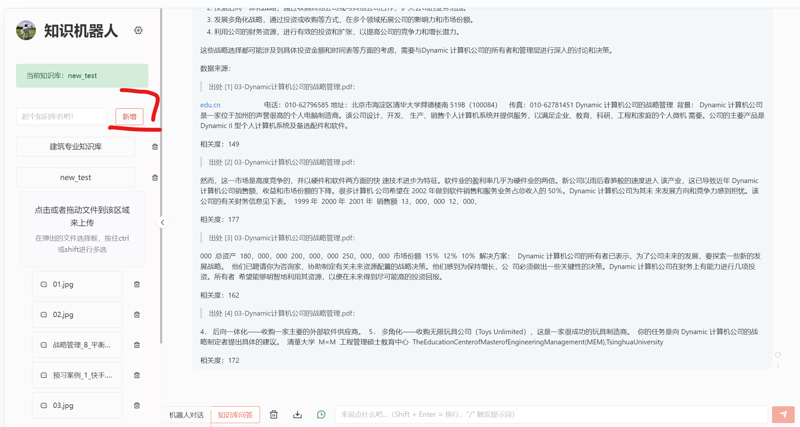
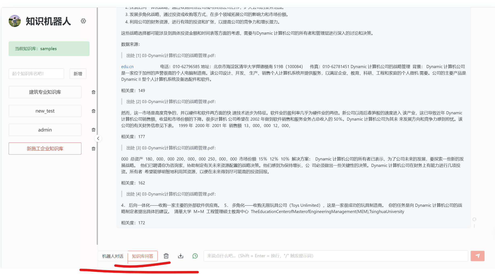
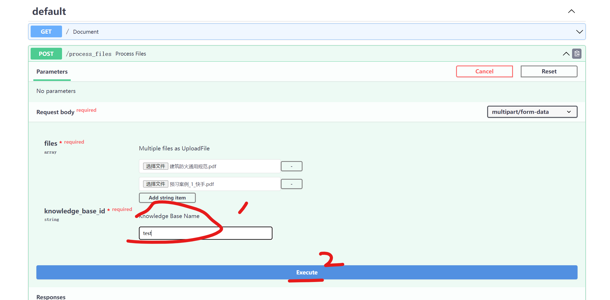

## 如何使用知识机器人

本地知识机器人能够根据用户已有的非结构化文档数据（pdf, docx, 图片, txt, markdown ）回答专业领域的问题。

### Web 访问

点击访问 [知识机器人 demo ](http://chatvue.cpolar.cn)

### 一般步骤：
- 新建知识库（如已经创建则省略）
- 选中相应知识库
- 上传文件（如已经上传则省略）
- 选择知识库问答
- 提问

### 新建知识库

### 选中知识库

### 选中知识问答

注意：
- 只有选中知识问答，才会根据知识库回答，否则会给一个一般性的回答。 

### 批量上传文件到知识库
文件较大较多情况下，建议使用[批量上传工具](http://batch-file.vip.cpolar.cn)

#### 批量上传一般步骤：
- 点击 try it out
  
- 添加要上传的文件
  
- 添加更多文件
  
- 填写要上传到的知识库
  
  - 注意：
    - 知识库必须已经在网页中创建好
- 点击 execute
- 等待文件传输完成，中间不要关闭页面

注意：
- 要加载的知识库必须已经在网页中创建好
- 文件批量上传完成后，并不意味着文档已经加载到知识库，只表示文档已经上传给知识库，文档加载到知识库这个过程会持续一段时间，加载成功后才能回答相应问题
- 只有图表的 Pdf 会加载失败，后续会修复这个问题
- 可以支持的文档格式包括 pdf, text, png, jpg, docs
- doc(不是 docx) 文件加载有问题，建议转成 docx 后加载
